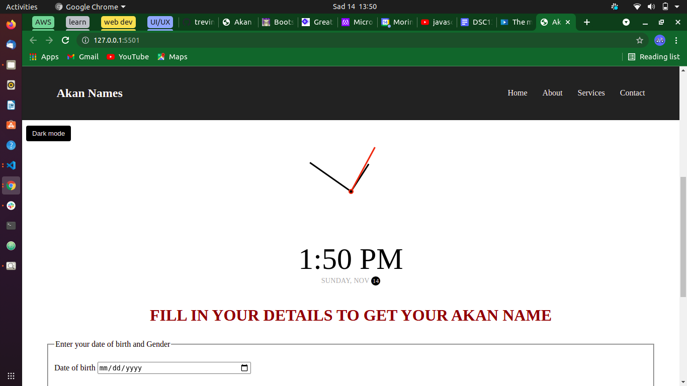

#read me file

# Author
Trevin Livele

## project description
This is a simple web Application that enables users to input their birth dates and 
it generates there respective Akan names based on there date of Birth

### copyright licence

This is an open source project that anyone can feel free to edit,modify and push to git hub freely.

## Technologies Used
Used html to create the layout of the page,used css and bootstrap for the styling purposes and js for the
 functionality"

.HTML
.CSS
.BOOTSTRAP
.JAVASCRIPT

## Support and contact details
Trevin Livele - Full stack software developer
Information Technology Expert
SEO => Search Engine Optimization Specialist
+254792691810

### Link to github pages

### License
Copyright (c) {2021} **{Trevin Livele}**
  